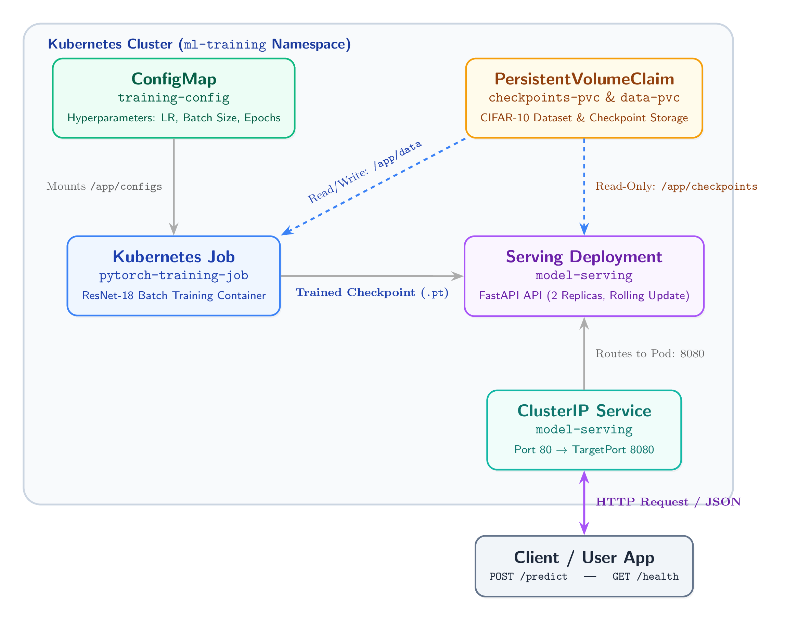

# MLOps PyTorch Pipeline

A production-ready PyTorch image classification pipeline featuring containerized model training with Docker, orchestrating batch jobs and real-time model inference on Kubernetes, complete with Git branching workflows and CI verification.

---

## 🏗 Architecture Overview



### System Components

| Component | Type | Responsibility |
| :--- | :--- | :--- |
| **ConfigMap** | `v1/ConfigMap` | Decoupled training hyperparameters (batch size, learning rate, epochs) |
| **Persistent Storage** | `PersistentVolumeClaim` | Shared storage for CIFAR-10 data cache and exported model weights |
| **Training Job** | `batch/v1 Job` | ResNet-18 batch training with early stopping and GPU acceleration |
| **Model Serving** | `apps/v1 Deployment` | 2-replica FastAPI inference service with rolling update & health probes |
| **ClusterIP Service** | `v1/Service` | Internal load-balanced network gateway on port 80 -> 8080 |
| **Auto-Scaler (HPA)** | `autoscaling/v2` | Dynamic replica scaling (2 to 10 pods) based on 80% CPU utilization |

---

## 📁 Repository Structure

```
mlops-pytorch-pipeline/
|-- README.md                         # Project documentation & architecture overview
|-- MLOps_Assignment_Report.pdf       # Consolidated submission report
|-- .gitignore                        # Git exclusion rules
|-- .github/
|   \-- workflows/
|       \-- ci.yml                    # Automated CI testing and Docker build pipeline
|-- src/
|   |-- train.py                      # Training loop with JSON logging & early stopping
|   |-- model.py                      # ResNet-18 model architecture
|   |-- dataset.py                    # Data loader with augmentation pipelines
|   \-- serve.py                      # FastAPI inference API with health checks
|-- configs/
|   \-- training_config.yaml          # YAML training hyperparameters
|-- docker/
|   |-- Dockerfile.train              # Multi-stage training image
|   \-- Dockerfile.serve              # Hardened, non-root serving runtime
|-- k8s/
|   |-- namespace.yaml                # Dedicated ml-training namespace
|   |-- configmap.yaml                # Decoupled training settings
|   |-- training-job.yaml             # Kubernetes Job with PVC & GPU tolerations
|   |-- serving-deployment.yaml       # High-availability Serving Deployment
|   |-- serving-service.yaml          # ClusterIP service exposing prediction endpoint
|   \-- hpa.yaml                      # Horizontal Pod Autoscaler
|-- requirements/
|   |-- train.txt                     # Pinned training dependencies
|   \-- serve.txt                     # Minimal inference dependencies
\-- tests/
    \-- test_model.py                 # PyTest test suite
```

---

## 🚀 Setup & Local Execution Guide

### Prerequisites
- Python 3.10+
- Docker Desktop
- `kubectl` CLI & Minikube/kind Kubernetes cluster

### 1. Local Training & Serving Verification
```bash
# Build training image
docker build -f docker/Dockerfile.train -t mlops-train:v1 .

# Run containerized training with mounted data/checkpoint directories
docker run --rm \
  -v $(pwd)/data:/app/data \
  -v $(pwd)/checkpoints:/app/checkpoints \
  mlops-train:v1

# Build serving image
docker build -f docker/Dockerfile.serve -t mlops-serve:v1 .

# Run serving container
docker run --rm -p 8080:8080 \
  -v $(pwd)/checkpoints:/app/checkpoints \
  mlops-serve:v1

# Test inference endpoint
curl -X POST http://localhost:8080/predict \
  -F "image=@test_image.png"
```

### 2. Kubernetes Deployment
```bash
# Apply namespace, configmap, and training job
kubectl apply -f k8s/namespace.yaml
kubectl apply -f k8s/configmap.yaml
kubectl apply -f k8s/training-job.yaml

# Monitor training job execution
kubectl get jobs -n ml-training -w

# Deploy serving deployment, service, and HPA
kubectl apply -f k8s/serving-deployment.yaml
kubectl apply -f k8s/serving-service.yaml
kubectl apply -f k8s/hpa.yaml

# Port-forward service to port 8080 for testing
kubectl port-forward svc/model-serving 8080:80 -n ml-training
```

## 📝 Project Reflection

### Key Challenges & Learnings

Building this end-to-end pipeline was an insightful exercise in connecting practical deep learning with real-world infrastructure. 

The most challenging part of the project was orchestrating the transition of model artifacts between training and serving inside Kubernetes. Training runs as a batch job that creates and updates model checkpoints, while serving runs continuously and needs immediate access to those saved weights. Setting up shared persistent volume claims (`PVCs`) and making sure the inference service didn't try to load incomplete weights during an active training epoch required careful coordination.

Another key learning point was configuring Kubernetes health probes and container permissions. Because PyTorch takes a few seconds to load the model into memory upon startup, early health checks can fail and cause pods to restart repeatedly. Adding an initial delay to the readiness probe solved this issue and ensured that traffic is only sent to pods once the model is fully loaded. Additionally, configuring non-root user permissions in Docker while retaining read access to mounted volumes highlighted important container security practices.

Overall, moving beyond local scripts to containerized workflows with automated CI and Kubernetes orchestration gave me a solid hands-on understanding of maintaining reliable, production-ready ML workloads.
